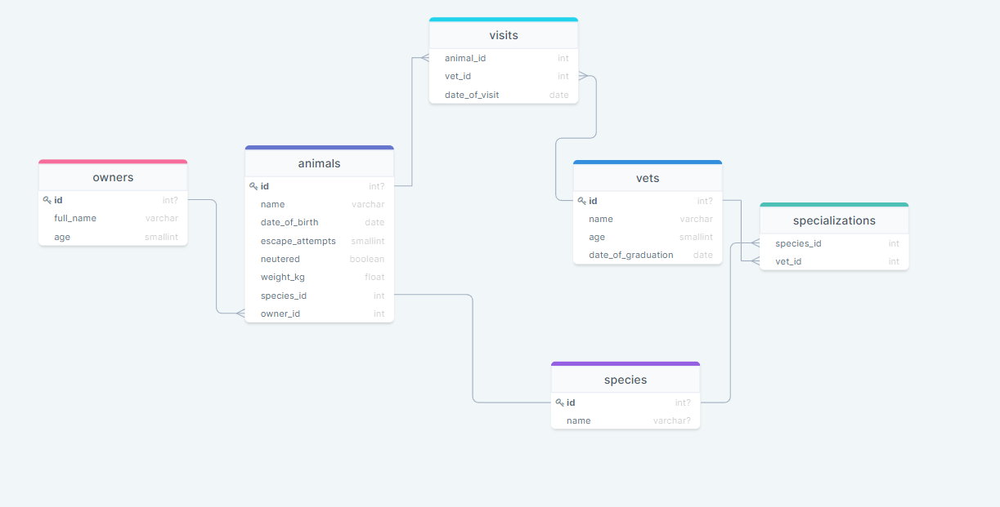

# Vet Clinic Database

> scripts to create the data structure for a vet clinic..

## Schema Diagram

## Getting Started

This repository includes files with plain SQL that can be used to recreate a database:

- Use [schema.sql](./schema.sql) to create all tables.
- Use [data.sql](./data.sql) to populate tables with sample data.
- Check [queries.sql](./queries.sql) for examples of queries that can be run on a newly created database. **Important note: this file might include queries that make changes in the database (e.g., remove records). Use them responsibly!**

## Authors

👤 **Juan Luis Palacios**

- GitHub: [@JuanLPalacios](https://github.com/JuanLPalacios)
- Twitter: [@JuanLuisPalac20](https://twitter.com/twitterhandle)
- LinkedIn: [LinkedIn](https://www.linkedin.com/in/juan-luis-palacios-p%C3%A9rez-95b39a228/)

## 🤝 Contributing

Contributions, issues, and feature requests are welcome!

Feel free to check the [issues page](../../issues/).

## Show your support

Give a ⭐️ if you like this project!

## 📝 License

This project is [MIT](./MIT.md) licensed.
